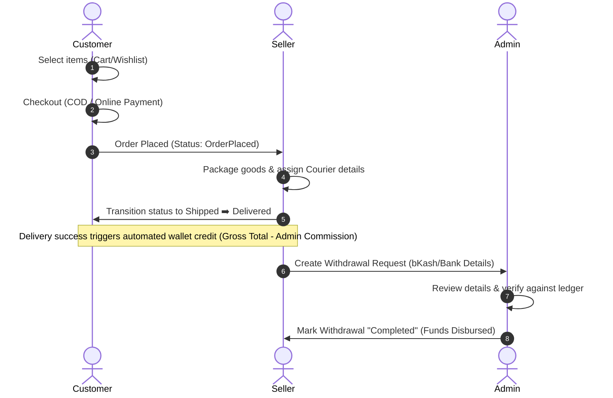
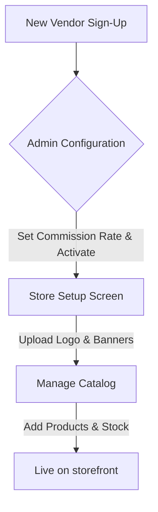

# User Manual: BanglaBazar Multi-Vendor Platform

Welcome to the **BanglaBazar Multi-Vendor Platform** user manual. BanglaBazar is a state-of-the-art e-commerce and ERP application designed to streamline online retail operations, facilitate multi-vendor coordination, and manage backend inventory and financials in a single unified dashboard.

This manual is structured to guide developers, customers, sellers, and system administrators through using the platform.

---

## Table of Contents
1. [System Overview & Architecture](#1-system-overview--architecture)
2. [User Roles & Access Matrix](#2-user-roles--access-matrix)
3. [System Initialization & Local Setup](#3-system-initialization--local-setup)
4. [Customer Portal Guide](#4-customer-portal-guide)
5. [Seller Portal Guide](#5-seller-portal-guide)
6. [Admin Dashboard Guide](#6-admin-dashboard-guide)
7. [Workflows & Diagrams](#7-workflows--diagrams)
8. [Troubleshooting & FAQs](#8-troubleshooting--faqs)

---

## 1. System Overview & Architecture

BanglaBazar integrates a **Customer Storefront** with a **Seller/Vendor Portal** and a **Business ERP/Admin Dashboard**. 

* **Frontend**: Next.js (App Router), React, TailwindCSS, and Shadcn UI.
* **State Management**: Redux Toolkit (with redux-persist) for cart and wishlist tracking.
* **Database & ORM**: Prisma ORM with MongoDB.
* **Authentication**: NextAuth.js managing secure roles.

---

## 2. User Roles & Access Matrix

The system segregates permissions based on three primary roles: **Customer**, **Seller**, and **Admin**. Below is a breakdown of their respective capabilities.

| Feature / Permission | Customer | Seller | Admin / Manager |
| :--- | :---: | :---: | :---: |
| Browse Products, Reviews, and Promos | ✅ | ✅ | ✅ |
| Manage Cart & Wishlist | ✅ | ❌ | ❌ |
| Place Orders & Track Delivery | ✅ | ❌ | ❌ |
| Rate & Review Delivered Products | ✅ | ❌ | ❌ |
| Request Order Returns / Refunds | ✅ | ❌ | ❌ |
| Vendor Portal Registration & Login | ❌ | ✅ | ❌ |
| Configure Store (Logo, Banner, Socials) | ❌ | ✅ | ❌ |
| Create & List Products (Stock, TP/MRP) | ❌ | ✅ | ✅ |
| Fulfill Orders & Update Tracking | ❌ | ✅ | ✅ |
| View Earnings Wallet & Request Payouts | ❌ | ✅ | ❌ |
| Approve / Reject Payout Requests | ❌ | ❌ | ✅ |
| Manage System Catalog (Categories, Brands, Units) | ❌ | ❌ | ✅ |
| Inventory Control (GRN, Adjustments, Damage Logs) | ❌ | ❌ | ✅ |
| Launch Campaigns (Flash Sales & Discounts) | ❌ | ❌ | ✅ |
| Audit User Logs & User Access Management | ❌ | ❌ | ✅ |

---

## 3. System Initialization & Local Setup

### Prerequisites
* Node.js v20.9.0 or higher
* A running MongoDB instance (Local or Atlas)

### Step 1: Environment Variables
Create a `.env` file in the root directory and specify the following variables:
```env
DATABASE_URL="mongodb+srv://<username>:<password>@cluster.mongodb.net/banglabazar?retryWrites=true&w=majority"
NEXTAUTH_SECRET="your-32-character-secret-key"
NEXTAUTH_URL="http://localhost:3000"
```

### Step 2: Dependencies & Database Schema Migration
Run the following commands to install dependencies and push the Prisma database schema:
```bash
npm install
npx prisma db push
```

### Step 3: Seed Default Data
Seed the database with pre-configured admin, customer, seller, product, and category assets:
```bash
npm run seed
```

> [!NOTE]
> **Default Test Credentials generated by seeding:**
> * **Admin**: Username: `admin` | Password: `admin123`
> * **Customer**: Phone: `01800000000` | Password: `customer123`
> * **Seller**: Phone: `01900000000` | Password: `seller123`

### Step 4: Run the Server
Launch the local Next.js development server:
```bash
npm run dev
```
Open [http://localhost:3000](http://localhost:3000) in your web browser to explore.

---

## 4. Customer Portal Guide

### Account Setup & Login
1. Navigate to the storefront and click on **Login/Register**.
2. Customers authenticate using their registered **Phone Number** and **Password**.
3. You can set up custom payment methods (e.g. Card, MFS, COD) and address profiles in your Customer Settings.

### Shopping Experience
* **Search & Filters**: Browse the storefront dynamically. You can filter items by Category, Brand, and Price Range.
* **Wishlist System**:
  * Click the **Heart Icon** on any product card to immediately save the item. A green success notification will pop up.
  * Open your **Wishlist** sidebar by clicking the heart button in the navbar.
  * In the wishlist drawer, you can view the items, see the MRP vs Promo Price discounts, remove items individually, or click **Move to Cart** to instantly transfer the item.
* **Cart & Checkout**:
  * Adjust quantities in the shopping cart drawer.
  * Proceed to the **Checkout** screen.
  * Complete shipping/billing forms, choose payment options (Cash on Delivery / MFS), and submit your order. Make note of your **Order ID**.

### Post-Purchase Actions
* **Tracking Orders**: Go to `http://localhost:3000/track-order`, type in your Order ID or tracking code (e.g., `PTH-12345`) to view live transit updates.
* **Submitting Reviews**: Once an order is delivered, go to the product detail page, select **Ratings & Reviews**, write your feedback, select star ratings (1-5), and submit.
* **Returns & Refunds**: Under **Customer Dashboard > Order History**, click on the completed order. If the status is marked "Delivered", a red **Request Return / Refund** button will be active. Provide a reason and submit.

---

## 5. Seller Portal Guide

### Shop Setup
1. Register/Login as a Seller via `http://localhost:3000/auth/seller/login`.
2. Go to **Settings > Store Setup** in your sidebar.
3. Input your **Store Name**, Description, email, phone, address, and social links (Facebook, Instagram). Upload high-res images for your **Store Logo** and **Store Banner**.

### Inventory & Products
* **Product Catalog**: View your active listings. Under **Products**, you can add details such as product name, slug, brand, base price, MRP, TP (Trade Price), available quantities, color, weight, and promotional parameters.
* **Stock & Inventory**: Keep track of opening vs closing quantities, sold items, and returns.

### Order Fulfillment
1. When a customer places an order containing your products, it appears under **Orders** on the Seller Dashboard.
2. Select **Update Tracking** from the actions menu.
3. Choose the shipping courier (e.g., "Pathao", "RedX") and assign a tracking code.
4. Transition the status progressively from **OrderPlaced** ➡️ **Processing** ➡️ **Shipped** ➡️ **Delivered**.

### Wallet & Payout Requests
Upon delivery, the sale amount (minus the admin commission percentage) is instantly credited to your wallet balance.
1. Navigate to **Wallet & Payouts**.
2. Review your **Available Balance**.
3. Under **Withdrawal Request**, specify your desired payout amount, payment method (e.g., Bank, bKash), and account details. Submit the request. It will show up as "Pending" until admin approval.

---

## 6. Admin Dashboard Guide

### System Configurations
* **Catalog Setup**: Admin maintains all system categories (nested parent-child hierarchies), brands, and measurement units (e.g., Pieces, Sets).
* **Vendor Directory**: Manage active/inactive vendors under **Marketplace > Vendors**. Adjust individual **Commission Rates** (e.g., 10%, 15%) that apply to their transactions.

### Inventory & Warehouse ERP Controls
* **Purchase Orders (PO)**: Generate formal procurement documents to suppliers.
* **Goods Received Notes (GRN)**: Confirm bulk items received at warehouses against matching POs.
* **Stock Adjustments & Damage Logs**: 
  * If stock levels must be corrected due to physical counts, issue a **Stock Adjustment** (In/Out) under **Adjust**.
  * Use the **Damage** panel to log unusable stock and automatically deduct items from active warehouse inventory.

### Campaigns & Marketing
1. Navigate to **Marketplace > Campaigns**.
2. Select a target Category (e.g., "Fashion & Clothing") and input a promo discount percentage (e.g., 20%).
3. Select start/end dates and click **Launch Campaign**.
4. The system will automatically compute the `promoPrice` across all applicable products and show them with discounted badges on the customer store.

### Payout Management
1. Review pending vendor withdrawals under **Marketplace > Payouts**.
2. Edit a pending withdrawal, select its status as **Completed** or **Rejected**, and supply transaction credentials.

### Security & Auditing
Admins can monitor system logs under **User Logs** to audit user activity, tracking login attempts, action modules, user-agents, and status updates for absolute accountability.

---

## 7. Workflows & Diagrams

### Order-to-Payout Workflow
The flowchart below traces an order's lifecycle, showing how wallet updates and admin approvals coordinate:



---

### Vendor Onboarding & Store Verification Workflow


---

## 8. Troubleshooting & FAQs

### Database Connection Failure
> [!CAUTION]
> If you encounter a `PrismaClientInitializationError` or connection timed out:
> * Double-check that your computer's IP address is whitelisted in MongoDB Atlas.
> * Confirm the `DATABASE_URL` matches your credentials and contains correct escape characters.

### Authentication Failures
> [!WARNING]
> If logins redirect with an error block or code:
> * Ensure `NEXTAUTH_SECRET` is configured in your environment.
> * Clean NextAuth session cookies in your browser settings and try again.

### Wishlist Items Don't Sync
* Wishlist is saved in local storage via Redux Persist. If you sign out or clear your browser data, your local wishlist might clear. Future releases will support backend syncing.

---
*Document Version: 1.0.0*
*Created Date: 2026-06-14*
